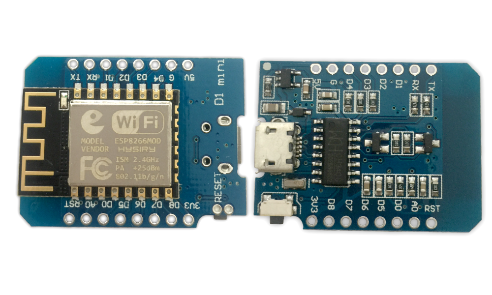
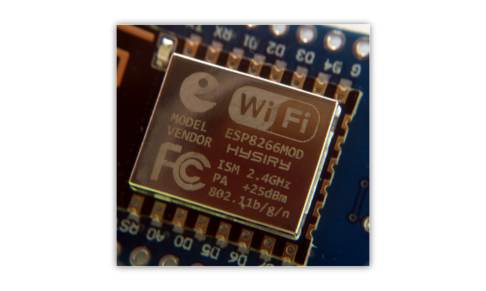

# ᵔᴥᵔ Wifi dB Meter
     
> Metering sound pressure (dB) and data logging via wifi to database backend

> **XSOURCE D1 Mini**
>
> This is the XSOURCE D1 Mini board, based on ESP8266 microcontroller

This is a simple little avr c/c++ project that i'm working on as i want to datalog the sound pressure (dB) at my appartment's balcony as there is construction going on outside. I simply wanted to see at what hours they worked and at what dB levels as they where not allowed to work at specific hours while being louder than 75dB.

It did not take long for me to settle on some ESP8266 spinoff variation that accepts avr C/C++, it has all i need. My goal was to use a analog data pin to read a adc value from a electret microphone amplifier like the Maxim MX4466 op-amp amplifier. To choose the correct ESP board is actually harder than you think, there are so many spinoff's from the original Wemos D1 mini. I ordered via Amazon (DE) and just took the first and cheapest i could find. This ended up being XCSOURCE® D1 Mini (TE441-DE). It was based on a mini Nodemcu Lua WiFi that used a ESP8266-12H from Shenzhen Hysiry Technology Co., Ltd. Again it's important to know that there are also a lot of the ESP8266 boards out there...

> **ESP8266-12H**
>
> This is the ESP8266 microcontroller from Shenzhen Hysiry Technology Co., Ltd

> Now lets build it, programm it and use it!
> Please note that the database backend part is not covered to a full extend here. It's up to you what you want to do with the data!

## Table of contents

 * [Wifi dB Meter](#wifi-db-meter)
 * [Apache / Database backend (data logging)](#apache--database-backend-data-logging)
 * [Donations](#donations)
 * [References](#references)
 * [Reporting Bugs](#reporting-bugs)
 * [Subscribe](#subscribe)

## Wifi dB Meter

> So to boil it all down, we want something to connect to a wifi network.
> Then if it has internet access, begin to post it's dB messurements to our backend.

I'm making the code so that it can connect to a list of predefined accesspoints the socalled "known wifi networks". It then scans for nearby wifi networks and checks if any of them are using no-encryption and tries to connect. If it has no internet access on that network it will blacklist it and continue it's search for a usable wifi network.

As soon as it has internet access it will begin to send the dB meter values to the backend server for post-processing. If the backend server or the http call fails in any way the unit will re-initialise and begin the wifi network scanning process again after a while.

I first wanted to use the Max 4466 (electret microphone amplifier) but i have now ordered a Max 9814 instead. It seems it's better quality and better op-amp and variable and automatic gain. So i can't wait to implement this.

It's faily simple, yet got some nice error checking rutines and features.

*My TODO list*

- [x] Get the Wifi dB Meter to connect to a wifi network
- [x] Get the Wifi dB Meter to HTTP (GET) request a url
- [x] Add simple wifi connection troubleshooting
- [x] Support a SSID blacklist
- [x] Add SSID blacklist check on scanning/adding
- [ ] Add SSID blacklist check on known wifi networks
- [ ] Streamline "known" wifi networks and how they are added
- [x] Look into the calculation of dB
- [ ] Find out dB SPL, or sound pressure level
- [ ] dB = 20 * log10(amplitude) - amplitude vs mx9814?
- [ ] 20 * log10 (V_noise / V_ref) + dB_ref - We have mic+opamp data sheet ?
- [ ] External SPL meter to calibrate your dB meter
- [ ] Messure reference amplification via 500 vs 1000 adc values
- [x] Internet connection error checking
- [x] Simple const char* / string variables to output encryption values
- [x] Simple const char* / string variables to output http response values
- [x] Scan for hidden BSSID's
- [x] Don't run the scanning process in async mode, wait for it!
- [ ] Support PING to check for internet connectivity (On hold for now)
- [x] Make use of the internal error checking in the ESP8266HTTPClient.h
- [x] Serial logging for DEBUG while developing
- [ ] Remove or make it easy to turn on/off serial output logging
- [x] Get ESP8266 flash chip information on boot
- [x] Use the ESP8266WiFiMulti.h for easy wifi network management
- [ ] Find a way to "clear" the added AP's
- [x] Make a disconnect fucntion / Recycle function
- [x] Find out how to set hostname for better DHCP/Dynamic DNS compatability
- [ ] Use IP adresses and not domain names ? Comfort / Setup vs Preformence ?
- [ ] Idea, make it connect to a predefines "setup" wifi network for easy external configuration ? 
- [ ] Idea, have it fetch configuration from a remote url and reboot ?
- [x] Changed from the MAX4466 to MAX9814 

## Apache / Database backend (data logging)

The backend is jsut a simple Apache web server hosting a PHP file that accepts GET requests from my Wifi dB Meter. It takes the arguments and save them to a database (MySQL in my case) where it logs the timestamp of the request to.

I log both the Analog value and the dB value. In fact, if you wanted to all you needed was the analog value and then do the dB calculations in the PHP script insted. This all depends on your c/c++ skills. No need to have trouble coding your mcu unit, keep it simple and easy!

The reason i use the request timestamp is that the esp8266 board don't have any realtime clock and so to keep it simple i just use the timestamp on the server. In the future you could expand this with either an real time clock or even better, since it has internet access - Just use a public ntp server etc.

## Donations

Code maintaining is hard! I need beer on a regular basis :)
This is of course fully optional, i just think it's nice to give the option.

You can donate Bitcoins or Ethereum to me for maintaining the project.

> Bitcoin address - 31jzgaJZuzGhDZQYrDTHQzmRFYnvHhzr57

> Ethereum address - 0x39BA5839830E9207FF3aC1c21d08d636548009D4

## References

When I find something online that I think I can use, implement or otherwise lean from when building my project I will show it here. There is of course a couple of major references/sources that keeps popping up again and again. These are listed below to.

> Data Sheets
 * [ESP8266-12H DataSheet](ESP8266-12H-DataSheet.pdf)
 * [MAX4465-MAX4469 DataSheet](MAX4465-MAX4469.pdf)
 * [MAX9814 DataSheet](MAX9814.pdf)

> Web sites
 * [Shenzhen Hysiry Technology Co., Ltd](http://en.hysiry.com)
 * [Maxim Integrated](https://www.maximintegrated.com/)
 * [FCC ID 2AKBPESP826612H](https://fccid.io/2AKBPESP826612H)
 * [MAX4465–MAX4469](https://www.maximintegrated.com/en/products/analog/audio/MAX4466.html)

## Reporting Bugs

Report all issues in the [issues tracker](https://github.com/kawaiipantsu/wifidbmeter/issues).

## Subscribe

Stay tuned to new releases with the project [feeds](https://github.com/kawaiipantsu/wifidbmeter/releases.atom).
